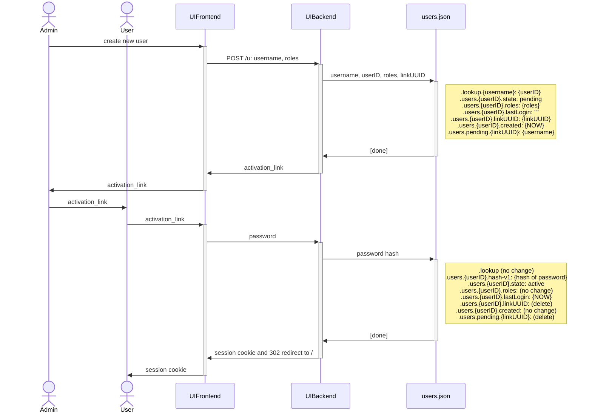

```mermaid
sequenceDiagram
  actor Admin
  actor User
  participant UIFrontend
  participant UIBackend
  participant users.json
  Admin->>+UIFrontend: create new user
  UIFrontend->>+UIBackend: POST /u: username, roles
  UIBackend->>+users.json: username, userID, roles, linkUUID
  Note right of users.json: .lookup.{username}: {userID}<br/>.users.{userID}.state: pending<br/>.users.{userID}.roles: {roles}<br/>.users.{userID}.lastLogin: ""<br/>.users.{userID}.linkUUID: {linkUUID}<br/>.users.{userID}.created: {NOW}<br/>.users.pending.{linkUUID}: {username}
  users.json->>-UIBackend: [done]
  UIBackend->>-UIFrontend: activation_link
  UIFrontend->>-Admin: activation_link
  Admin->>User: activation_link
  User->>+UIFrontend: activation_link
  UIFrontend->>+UIBackend: password
  UIBackend->>+users.json: password hash
  Note right of users.json: .lookup (no change)<br/>.users.{userID}.hash-v1: {hash of password}<br/>.users.{userID}.state: active<br/>.users.{userID}.roles: (no change)<br/>.users.{userID}.lastLogin: {NOW}<br/>.users.{userID}.linkUUID: (delete)<br/>.users.{userID}.created: (no change)<br/>.users.pending.{linkUUID}: (delete)
  users.json->>-UIBackend: [done]
  UIBackend->>-UIFrontend: session cookie and 302 redirect to /
  UIFrontend->>-User: session cookie
```

